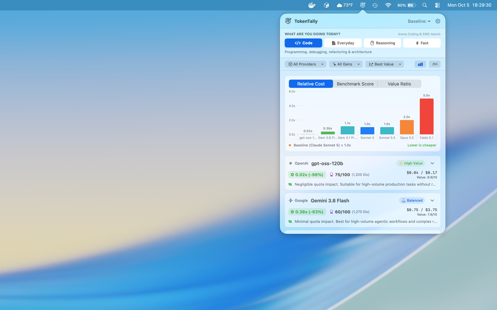

# TokenTally

> **Real-Time AI Model Cost & Benchmark Comparison for macOS**  
> Native menu bar utility for developers, researchers, and AI builders.

- **Website:** [tokentally.garde.one](https://tokentally.garde.one)  
- **Privacy Policy:** [tokentally.garde.one/privacy](https://tokentally.garde.one/privacy)

---

## Overview

**TokenTally** is a native macOS menu bar app that brings immediate transparency to AI token economics. It gives you instant, at-a-glance visibility into LLM pricing, benchmark intelligence, and cost multipliers across every major model and provider without leaving your workflow.

- **Workload Presets:** Instant recommendations optimized for **Code** (SWE-bench & Arena Coding), **Everyday Chat**, **Deep Reasoning**, or high-throughput **Fast** pipelines.
- **Relative Cost Multipliers:** Compare pricing normalized against any baseline model (such as Claude 3.5 Sonnet, Claude 3.7, or GPT-4o) to immediately spot cost deltas (e.g. `0.02x`, `0.38x`, `5.0x`).
- **Interactive Token Simulator [f(x)]:** Simulate real workflows across models with presets like **Quick Q&A**, **Daily Coding**, **Deep Refactor**, and **Huge Context** to project dollar savings before launching jobs.
- **Value Ratio Scoring:** Weighted scores balance benchmark performance against per-million token costs so you never overpay for agentic loops or production jobs.
- **100% On-Device Privacy:** Zero tracking, zero telemetry, zero accounts. All calculations happen right on your Mac.

### Additional Branding & Web Assets
- **Window Overview Asset:** [`assets/tokentally-window.png`](assets/tokentally-window.png)
- **Window Model Details Asset:** [`assets/tokentally-2-details-window.png`](assets/tokentally-2-details-window.png)
- **Window Simulator Asset:** [`assets/tokentally-3-calculator-window.png`](assets/tokentally-3-calculator-window.png)
- **App Icon (SVG):** [`assets/icon-app.svg`](assets/icon-app.svg)
- **Vector Logo (SVG):** [`assets/logo.svg`](assets/logo.svg)

---

## Privacy Policy

TokenTally has a strict **Zero Data Collection Policy**. We do not collect, store, transmit, or sell any personal information, telemetry, usage metrics, or AI prompts.

Read our full Privacy Policy at **[tokentally.garde.one/privacy](https://tokentally.garde.one/privacy)**.

---

## Author & Contact

- **Developer:** Mike Garde
- **Domain:** [tokentally.garde.one](https://tokentally.garde.one)
- **Email:** [tokentally@garde.one](mailto:tokentally@garde.one)
